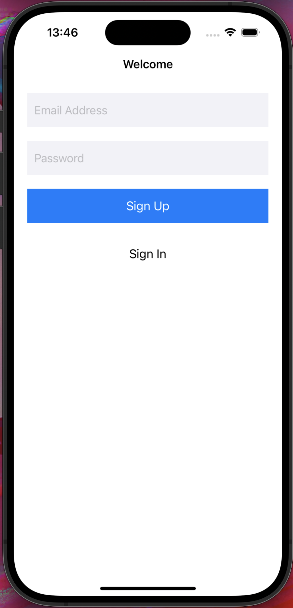
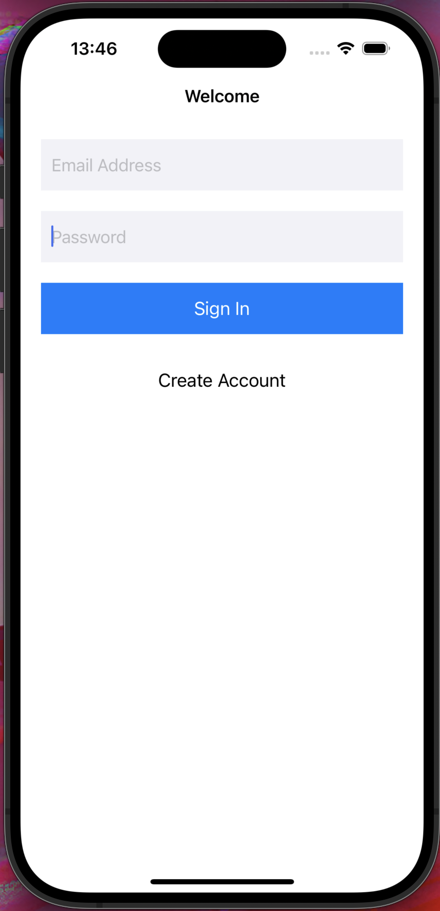
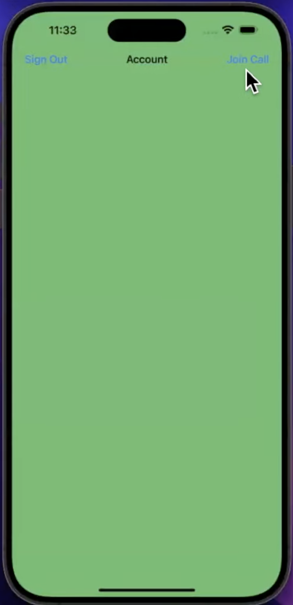
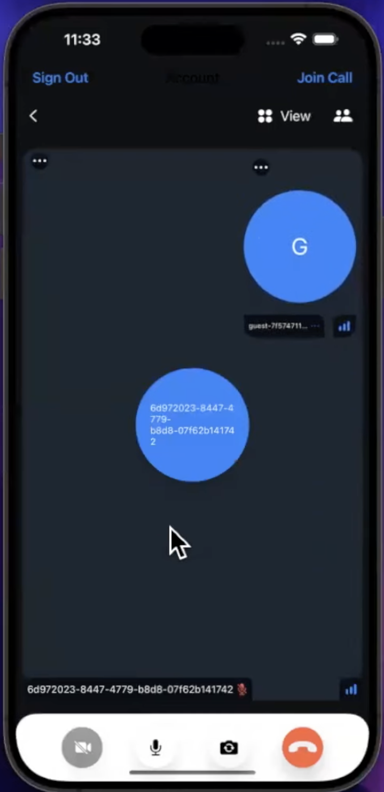

# Clone de FaceTime

## Description
Ce clone de l'application FaceTime est réalisé avec Swift et UIKit pour la création de l'interface utilisateur. Stream est utilisé pour la gestion des appels vidéo et Firebase pour l'authentification par email/mot de passe.

## Fonctionnalités
- Appels vidéo en temps réel.
- Authentification par email et mot de passe.

## Technologies Utilisées
- **Langage**: Swift
- **Framework**: UIKit
- **API**: Stream pour les appels vidéo
- **Firebase**: Stream pour les appels vidéo,

## Captures d'écran

Voici quelques captures d'écran de l'application :

*Écran d'inscription.*

*Écran de connexion.*

*Écran d'accueil qui permet aux utilisateurs de visualiser leurs comptes, rejoindre un call et se déconnecter.*

*Écran d'appel vidéo en cours.*

## Prérequis
Avant de commencer, assurez-vous d'avoir les éléments suivants :
- Un Mac avec Xcode installé.
- Un compte développeur Apple pour tester sur un appareil physique (facultatif mais recommandé).
- Clé API Stream et Firebase.
